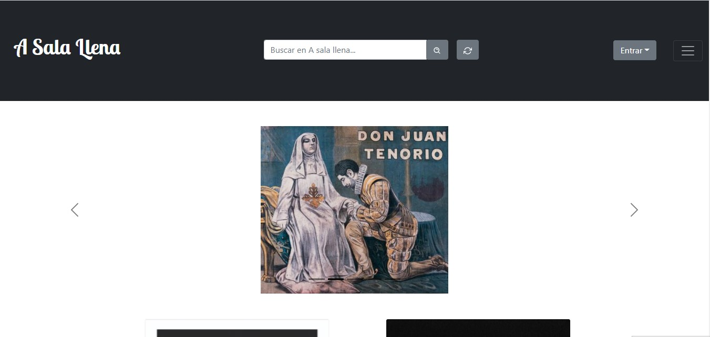
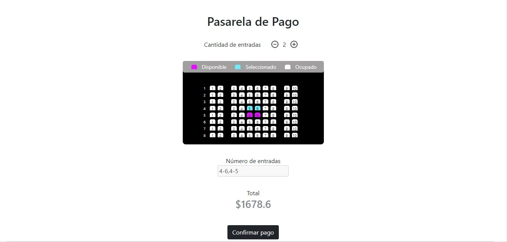
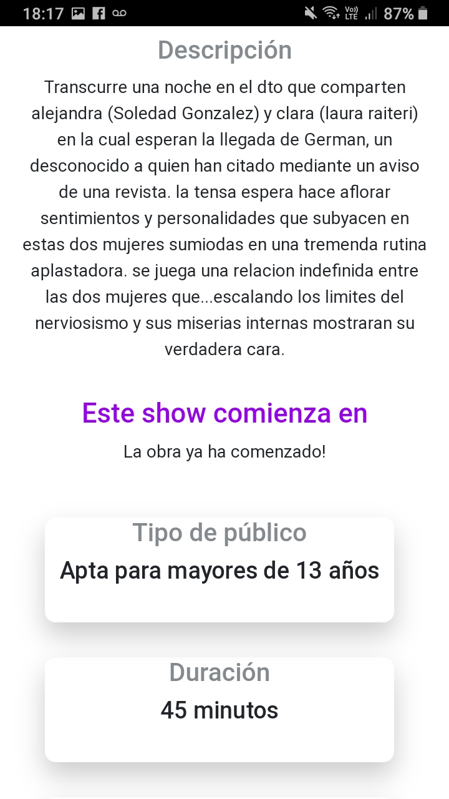
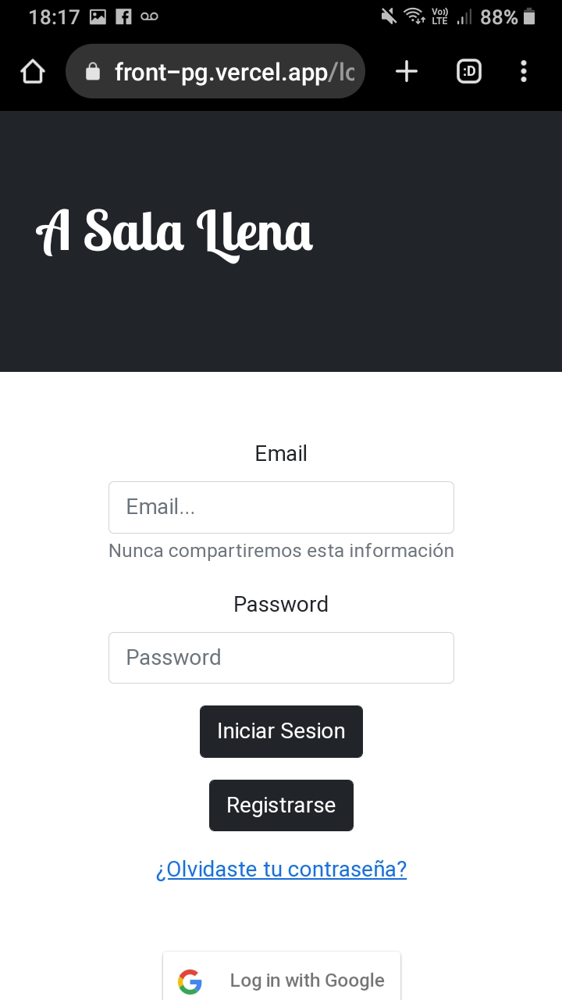
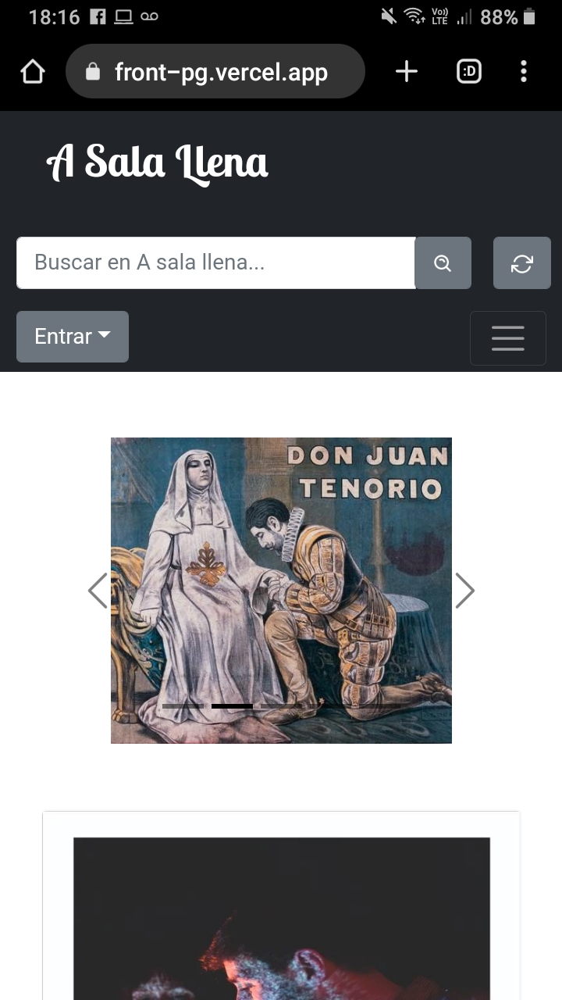

# Front A Sala Llena

Este proyecto fue creado en grupo para el Bootcamp Henry

Se utilizaron las siguientes tecnologias:

React

HTML5

CSS3

React-Countdown

React-Bootstrap

React-Google-Login

Axios

Redux

React-Hook-Form

React-Icons

Sweetalert

 

